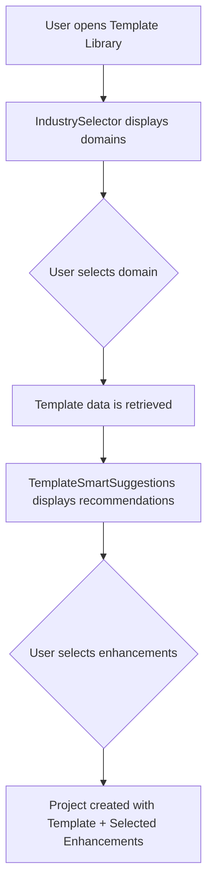

# Industry-Specific Template System

The Industry-Specific Template System provides a robust framework for creating tailored e-learning courses based on specific professional domains. It combines a centralized data repository with interactive components to guide users through the course creation process.

## System Overview

The system consists of three primary layers:
1.  **Data Layer**: [`industryTemplates.js`](../frontend/src/data/industryTemplates.js) - Defines the structure and content of all available templates.
2.  **Selection Layer**: [`IndustrySelector.js`](../frontend/src/components/TemplateLibrary/IndustrySelector.js) - A UI component for choosing a domain.
3.  **Enhancement Layer**: [`TemplateSmartSuggestions.js`](../frontend/src/components/TemplateLibrary/TemplateSmartSuggestions.js) - Recommends additional assessments and learning objects based on the selected template.

---

## Data Structure: `industryTemplates.js`

Templates are defined as JavaScript objects within [`industryTemplates.js`](../frontend/src/data/industryTemplates.js).

### Template Schema

Each template object follows this structure:

| Property | Type | Description |
| :--- | :--- | :--- |
| `id` | `string` | Unique identifier for the template. |
| `name` | `string` | Display name of the template. |
| `description` | `string` | Brief overview of the course content. |
| `category` | `string` | Reference to `INDUSTRY_DOMAINS` constant. |
| `industry` | `string` | Human-readable industry name. |
| `difficulty` | `string` | Target learner level (e.g., "Beginner"). |
| `estimatedTime` | `number` | Estimated duration in minutes. |
| `tags` | `string[]` | Keywords for search and filtering. |
| `suggestedQuestions` | `string[]` | IDs of questions from the Question Bank. |
| `suggestedLearningObjects` | `string[]` | IDs of objects from the Learning Object Repository. |
| `theme` | `object` | Default colors (`primaryColor`, `secondaryColor`, `accentColor`). |
| `pages` | `array` | Array of page objects containing content blocks. |

### Content Blocks

Content within pages is created using the `createContentBlock` helper:
```javascript
createContentBlock(type, content, title = '', metadata = {})
```

---

## Components

### IndustrySelector

The [`IndustrySelector`](../frontend/src/components/TemplateLibrary/IndustrySelector.js) component is the entry point for users. It displays available industries in either a Grid or List view.

**Props:**
- `onSelectIndustry(industry)`: Callback triggered when an industry is chosen.
- `onCancel()`: Callback to close the selector.

### TemplateSmartSuggestions

The [`TemplateSmartSuggestions`](../frontend/src/components/TemplateLibrary/TemplateSmartSuggestions.js) component appears after a template is selected. It allows users to "opt-in" to additional content.

**Key Features:**
- **Suggested Assessments**: Lists questions mapped to the template's `suggestedQuestions`.
- **Suggested Learning Objects**: Lists content pieces mapped to `suggestedLearningObjects`.
- **Course Preview**: Shows metadata like estimated time and page count.

---

## How to Add a New Template

To add a new industry template, follow these steps:

1.  **Define the Domain**: Add a new key to the `INDUSTRY_DOMAINS` constant in [`industryTemplates.js`](../frontend/src/data/industryTemplates.js).
    ```javascript
    export const INDUSTRY_DOMAINS = {
      // ... existing domains
      RETAIL: 'retail-training'
    };
    ```

2.  **Create the Template Object**: Define your template using the schema above. Use `createContentBlock` to populate pages.

3.  **Export the Template**: Add the new template to the `INDUSTRY_TEMPLATES` export object.

4.  **Update UI Metadata**:
    - Add an icon to `INDUSTRY_ICONS` in [`IndustrySelector.js`](../frontend/src/components/TemplateLibrary/IndustrySelector.js).
    - Add a description to `INDUSTRY_DESCRIPTIONS` in [`IndustrySelector.js`](../frontend/src/components/TemplateLibrary/IndustrySelector.js).
    - Add the domain to the `availableIndustries` array in [`IndustrySelector.js`](../frontend/src/components/TemplateLibrary/IndustrySelector.js).

5.  **Map Suggestions (Optional)**: If you have specific questions or learning objects, add their IDs to the `suggestedQuestions` and `suggestedLearningObjects` arrays and ensure they are handled in [`TemplateSmartSuggestions.js`](../frontend/src/components/TemplateLibrary/TemplateSmartSuggestions.js) helper functions.

---

## Interaction Flow


